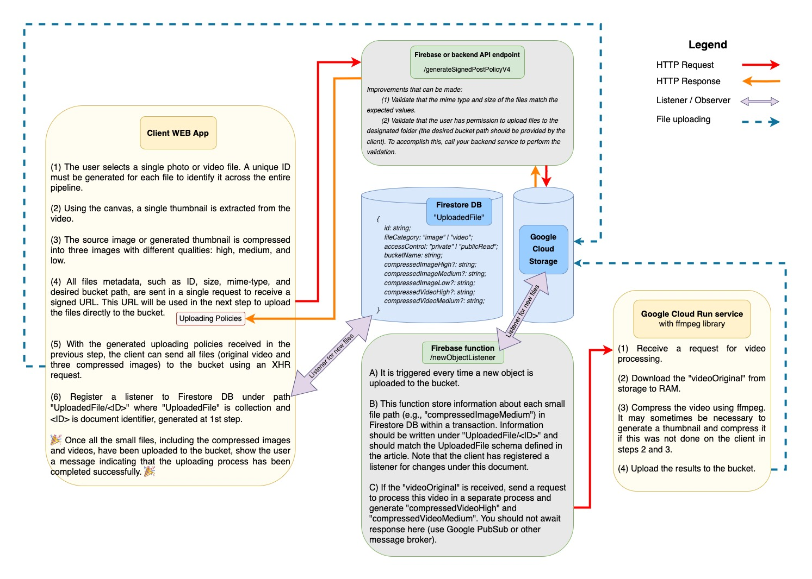

# Photo and video compression pipeline in modern web applications

```diff
+ This is a draft of my future article for professional blog.
```

## 1. Foreword

Media file compression refers to the process of reducing the size of digital media files, such as audio, video, and images, by using various compression algorithms. This is done to make the files smaller in size, without significantly compromising their quality, in order to make them easier to store, share, and transmit over the web. Compression reduces the amount of data needed to store or transmit the media file, which in turn makes it faster to load and stream over the internet. This is particularly important for web-based applications, where large media files can take a long time to load, and can cause buffering or other performance issues. By compressing media files, web developers can ensure that their content loads quickly and smoothly, providing a better user experience for their audience.

## 2. Architecture

We need to design a system that will allow users to upload source media files (such as images and video) to persistent storage. We also need to deliver those media files (already compressed) over HTTP protocol from storage to web clients. Some of the media files will be accessible to all users, others will be private and protected with an access control policy.



## 3. Compression configuration

We're gonna receive images and videos from clients in different sizes. To compress them we will use the following configuration options:

```
const config = {
 high: {
   quality: 0.95,
   width: 1920,
   height: 1080,
   fit: "outside",
 },
 medium: {
   quality: 0.95,
   width: 576,
   height: 1024,
   fit: "outside",
 },
 low: {
   quality: 0.9,
   width: 160,
   height: 160,
   fit: "inside",
 }
}
```

Parameter `quality` is a number between 0 and 1 that specifies the quality of compression results. A higher value means better quality of result, but at the same time, it produces larger files.

Parameter `fit: outside` work similarly to `object-fit: contain` css property (width and height will be recognized as max-width and max-height and resulting file dimensions will not be larger than those values).

Parameter `fit: cover` works similarly to `object-fit: cover` css property (width and height will be recognized as min-width and min-height and resulting file dimensions will not be less than those values).

We build this config based on the idea that desktop clients will receive high-quality media files, whereas mobile phones and tablets will receive medium-quality media files. For small avatars, all clients will receive low-quality media files.

## 4. DB schema and UploadedFile representation

Let’s suppose you have the following entities on your backend: Shop and Product.
Each shop could contain a few products and each product could have several media files associated with it.

In the current article, we’re going to consider uploading one media file per request, but you could easily improve your code to process several media files in a parallel or in a queue.
One source media file will produce a few media files on our server side (for photos we will produce thumbnails in high, medium, and low qualities).

Let's agree on some terminology:

- Uploaded file - is either a source file provided by user input or a database representation of this file after the complete processing (we named it `UploadedFile`).

- Compressed file - is only one piece of the resulting file (it could be a compressed image in high quality or compressed video in medium quality but both of them are produced from one source uploaded file).

As a result, after we process a single media file received from the client we should store information about it in the database in the format described below. If your application does not require 3 types of compressed images in the high, medium, and low format you could play with this part. More details about the configuration you could find in paragraph 3. Compression configuration.

```
export type UploadedFile = {
 id: string;
 fileCategory: "image" | "video";
 accessControl: "private" | "publicRead";
 bucketName: string;
 videoOriginal?: string;
 compressedImageHigh?: string;
 compressedImageMedium?: string;
 compressedImageLow?: string;
 compressedVideoHigh?: string;
 compressedVideoMedium?: string;
}
```

When a client requests to read Product information, we will provide them with `product.title`, `product.description`, and `product.uploadedFile` object. In case the file is publicly available, the object can be concatenated into a URL to read the file from the bucket. However, if the file has "private" access control, we need to sign the read URL first and then provide it to the client. Please take a look at the [getSignedUrl](https://googleapis.dev/nodejs/storage/latest/File.html#getSignedUrl) method for do it.

## 5. Photo processing

Photo compression will be executed on the client side. Pay attention that some formats of photo files (such as HEIC and HEIF) are incompatible with existing compression libraries. Because of this we first convert such images to image/jpeg mime type using [heic2any](https://www.npmjs.com/package/heic2any).

Generally, we're gonna convert and compress all photos in `image/webp` format. WebP is an image format developed by Google that provides several advantages over other image formats such as PNG, JPEG, and GIF. One of the main advantages of WebP is its superior compression algorithm, which can significantly reduce the size of image files without compromising image quality. This means that WebP images load faster, consume less bandwidth, and use less storage space on servers and devices.

So for compression images on the client side, we use [compressorjs](https://www.npmjs.com/package/compressorjs). Please notice that if the client uses Safari browser this compressor could not produce images with mime-type image/webp. Because of that for Safari, we are ok to produce compressed images with image/jpeg.

```
// For convert image/heic to image/jpeg you could do
const convertedImage = await heic2any({
  blob,
  toType: 'image/jpeg',
  quality: 1,
});

// For compress image you could do
const compressImage = new Promise((resolve, reject) => {
    new Compressor(imageForCompression, {
    quality: <QUALITY_FROM_CONFIG>,
    maxWidth: <WIDTH_FROM_CONFIG>,
    maxHeight: <HEIGHT_FROM_CONFIG>
    mimeType: IS_SAFARI ? "image/jpeg" : "image/webp", // IOS Safari could not compress to webp
    success(result) {
      resolve(result)
    },
    error() {
      reject()
    },
  });
})
```

<ins>ATTENTION</ins>: Image compression on the client side produces different results for different browsers, so the quality of compressed images is not always ideal. If you need to achieve better image quality please consider using server-side compression tools such as Firebase Image Compression extension or ffmpeg library.

## 6. Generate POST signed URL on the server side

We’re going to upload compressed media files (or upload the source file itself if it was video) directly to the storage bucket. But before doing that we have to generate a POST signed URL policy for every file using [generateSignedPostPolicyV4](https://googleapis.dev/nodejs/storage/latest/File.html#generateSignedPostPolicyV4) method.
This code will be executed on a server-side by a client request. All necessary information for metadata should be provided by a client. We send in the request body to the server side where the following code should be executed.

Let's say we upload a photo file and we did compression on the client.
Then we should upload the following resulting files to the bucket: compressed images in high, medium, and low quality.

```
// allFilesInfo - JSON object which is coming from client in a single POST request
// containing info about all compressed files and/or about original video (if it was uploaded)

const policies = {}

for (const oneFileKey of [
  “compressedImageHigh”,
  “compressedImageMedium”,
  “compressedImageLow”
]) {
    const file = storageClient
      .bucket(DEFAULT_BUCKET_NAME)
      .file(uploadingPath);

    const metadata: CustomObjectMetadata = {
      "uploaded-file-id": <ID>,
      "one-file-key": oneFileKey,
      "file-category": fileCategory,
      "access-control": accessControl,
      "bucket-name": DEFAULT_BUCKET_NAME,
      "is-thumbnailing-required":
        oneFileKey === OneFileKeyEnum.VIDEO_ORIGINAL &&
        (!allFilesInfo.compressedImageHigh ||
          !allFilesInfo.compressedImageMedium ||
          !allFilesInfo.compressedImageLow)
          ? "true"
          : "false",
    };


    const policy = await file.generateSignedPostPolicyV4({
      expires: new Date(Date.now() + 1 * 60 * 1000),
      fields: {
        "acl": "public-read" or "private",
        ...Object.fromEntries(
          Object.entries(metadata).map(([k, v]) => [`x-goog-meta-${k}`, v])
        ),
      },
    });

    const policies[oneFileKey] = policy
}

res.send(policies)
```

## 7. Uploading compressed files to storage by XHR requests

On the client side, after receiving a response with policies we could initiate uploading of necessary files (`compressedImageHigh`, `compressedImageMedium`, `compressedImageLow`, `videoOriginal`) directly to a bucket.

```
// You could do a parallel upload of all the compressed files (and/or original video)
// Below you see example of uploading single compressed file independetly

const policy = policies[“compressedImageHigh”];

const formData = new FormData();
for (const [key, value] of Object.entries(policy["fields"])) {
  formData.append(key, value);
}
formData.append("file", file);
const xhr = new XMLHttpRequest();
xhr.open("post", policy["url"]);
xhr.send(formData);
xhr.onerror = (err) => {
  reject(err);
};
```

We also need to register a listener on Firestore DB to receive updates about all compressed files which are processed and uploaded to the bucket.
Pay attention that some resulting compressed files (`compressedVideoHigh`, `compressedVideoMedium`) will be produced on the server side and uploaded to the bucket also.

```
onSnapshot(
  doc( firestore, "Uploading",ID),
  async (doc) => {
	  // Uploading is successful when document contain all necessary small files
    // For image: compressedImageHigh, compressedImageMedium, compressedImageSmall
    // For video: same as for image plus compressedVideoHigh, compressedVideoMedium
  }
)
```

## 8. Listener of new objects uploaded to storage

We use firebase functions to monitor new files uploaded to Google Cloud Storage.

```
export const newObjectListener = functions
 .storage.bucket(DEFAULT_BUCKET_NAME)
 .object()
 .onFinalize(async (object) => {
  const metadata = object.metadata // contain id, file category, uploading path etc...

  // You need to write information about each newly received object (small file) to Firestore DB.
  // You could get all necessary information from object.metadata (we did provide it from client side previously).
  // On first trigger call it could be:
  const documentData = {
    id: <ID>;
    fileCategory: "video";
    accessControl: "publicRead";
    bucketName: DEFAULT_BUCKET_NAME;
    videoOriginal: "/shops/<SHOP_ID>/products/<PRODUCT_ID>/videoOriginal.mov"
  }

  // If newly recieved object file category is video then you should request processing of video file in side process
  PubSub.trigger.compressVideo(videoFileMetadata)

  // Do not forget that for some videos we were unable to generate thumbnails (compressedImageHigh, compressedImageMedium, compressedImageLow) on client.
  // For those type of videos you should also execute thumbnail generation and image compression on server side
  PubSub.trigger.generateThumbnailAndCompressIt(videoFileMetadata)

  // After side process will be completed video compression results will be uploaded to bucket.
  // It will trigger newObjectListener again and new piece of information will be stored in Firestore DB.
  // After those you will get something like
  const documentData = {
    id: <ID>;
    fileCategory: "video";
    accessControl: "publicRead";
    bucketName: DEFAULT_BUCKET_NAME;
    videoOriginal?: "/shops/<SHOP_ID>/products/<PRODUCT_ID>/videoOriginal.mov",
    videoCompressedHigh: "/shops/<SHOP_ID>/products/<PRODUCT_ID>/videoCompressedHigh.mp4"
    videoCompressedMedium: "/shops/<SHOP_ID>/products/<PRODUCT_ID>/videoCompressedMedium.mp4"
  }
```

Listener registered on client side (see previous paragraph) will receive all changes in the document. If all necessary compressed files information exists in Firestore DB - it mean that processing completed successfully.

## 9. Video processing

Here is a plan:

1. Receive video file metadata and download it from the bucket to the current environment;
2. Generate thumbnail;
3. Compress thumbnail to 3 different qualities (compressedImageHigh, compressedImageMedium, compressedImageLow);
4. Compress video to 2 different qualities (compressedVideoHigh, compressedVideoMedium);

### Thumbnail generation - client side

For a video file firstly we need to generate a thumbnail. We will try to make it on the client using native HTML API. Based on line 4 of the following code snippet thumbnail generation will not work for video/quicktime files (those videos are produced by iPhones and have .MOV format). We will process them later on the server side.

```
const generateThumbnail = new Promise((resolve, reject) => {
  if (
    fileCategory === FileCategoryEnum.VIDEO &&
    sourceFile.type !== "video/quicktime" &&
    !IS_SAFARI
  ) {
    let video = document.createElement("video");
    video.preload = "metadata";
    video.src = URL.createObjectURL(sourceFile);
    video.muted = true;
    video.playsInline = true;
    video.play();

    video.addEventListener("loadeddata", (): void => {
      const canvas = document.createElement("canvas") as HTMLCanvasElement;
      canvas.width = video.videoWidth;
      canvas.height = video.videoHeight;
      const context = canvas.getContext("2d");
      context!.drawImage(video, 0, 0, canvas.width, canvas.height);
      video.pause();

      canvas.toBlob((result) => {
        resolve(result);
      }, "image/jpeg");
    });
  } else {
    resolve(null);
  }
})
```

### Thumbnail compression - client side

After you receive a thumbnail from the video file using canvas, you could compress it with the pipeline described in the previous paragraph named Photo processing.

<ins>ATTENTION</ins>: If thumbnail generation and thumbnail compression could not be executed on the client side - you should do it on the server side. Look at the previous paragraph at line: `PubSub.trigger.generateThumbnailAndCompressIt(videoFileMetadata)`. For sure you should create `PubSub.listener` and using ffmpeg library to generate a thumbnail image and then compress it.

### Video compression - server side

Should be executed in a separate process.
Should not be awaited by any request, just do compression and upload results to the bucket when ready.
An ideal environment for this code is Google Cloud Run with ffmpeg library installed.
We use [fluent-ffmpeg](https://www.npmjs.com/package/fluent-ffmpeg) library but you could use native ffmpeg syntax and spawn process in node.js.

During testing, Firebase functions showed poor performance. The video compression time was significantly longer (3-5 times) on the second call of the function when it wasn't cold-started compared to the first cold-started call. I was unable to resolve this issue within Firebase functions environment, so I suggest considering alternatives like Cloud Run or App Engine for this task. However, you could still try experimenting with Firebase. By the way, ffmpeg package is pre-installed in the firebase functions environment.

We should run the following compression command twice to produce a high-quality and medium-quality video (with different `maxWidth` and `maxHeight` parameters, which are defined above in paragraph Compression Config).

```
ffmpeg()
  .input(inputPath)
  .videoCodec("libx264")
  .format("mp4")
  .outputOptions([
    "-crf 23",
    "-movflags +faststart",
    `-filter:v scale=ceil('min(${maxWidth},iw)/2')*2:ceil('min(${maxHeight},ih)/2')*2:force_original_aspect_ratio=decrease:force_divisible_by=2`,
    "-acodec copy",
  ]).on("end", async (...ffmpegArgs) => {
      /// upload to storage
  }).on("error", (...ffmpegArgs) => {
      // handle error
  }).on("progress", (progress) => {
      // handle processing progress
  }).output(outputPath)
  .run();
```

What does each output option mean?

- `-crf`: configure compression quality;
- `-movflags +faststart`: is useful for web video. When the client will receive it he will be available to play it faster, even if the whole file is not downloaded yet. Pay attention that with this option you could not write to the output stream;
- `-filter:v scale=...`: is compression configuration;
- `-acodec copy`: says ffmpeg to copy audio stream to converted file without any changes. You could play with this option, but without this line, some videos recorded on iPhone produced sound distortion artifacts after compression.

# Additional improvements that can be made:

1. Validation of input media files (formats, sizes, dimensions). Validation should be done at least on the server, but for better user experience and to save resources you could repeat it on the client side.
2. Configure paths in the bucket to clearly organize media files by folders.
3. Validate that user who wants to make a new upload has access to write into a particular folder in the bucket.
4. Showing aggregated percentage of compressing and uploading process.
5. Handle potential exceptions and errors.
